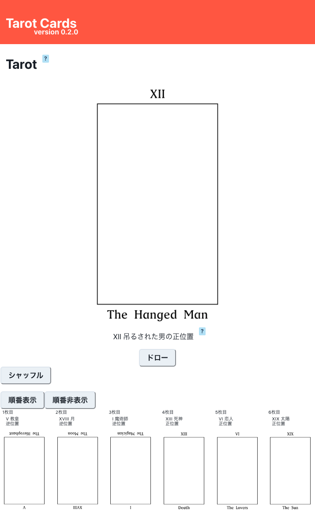
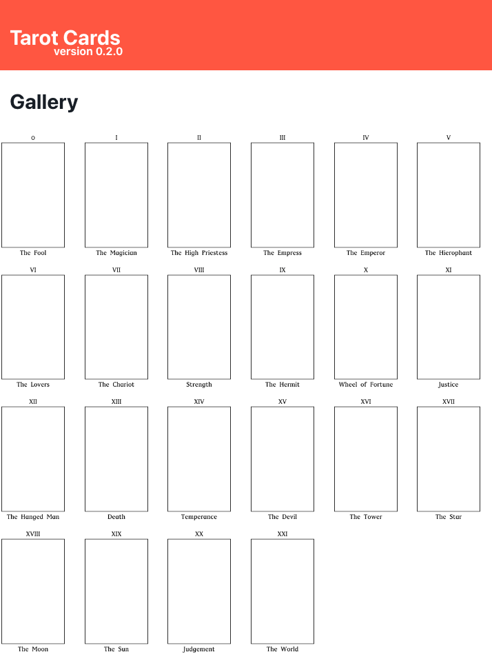

# Tarot の React アプリ
## デバッグ方法
1. ディレクトリ `tarot/react/` で下記コマンドを実行
    ```
    $ yarn start
    ```
## ビルド方法
### 手動でのビルド
1. ディレクトリ `tarot/react/` で下記コマンドを実行
    ```
    $ npm run build
    ```
2. ディレクトリ `tarot/react/build/` にビルドされる
### 自動で GitHub Pages に ビルド & デプロイ
1. **mainブランチ** にマージする
2. GitHub Actions によって自動で ビルドとデプロイがされる

## 実装機能一覧
### Home Page
- タロットの シャッフル & ドロー
  - **タロットの種類** : 22枚
  - **ドロー** に関して
    - "ドロー" ボタン で 1枚ドロー
    - 初回ドローはシャッフルが必要
  - **シャッフル** に関して
    - "シャッフル" ボタン でシャッフル
    - 22枚をランダムでシャッフルする
    - ドローを数回した後のシャッフルも 22枚のシャッフルとなり、次のドローは 1枚目になる
- 解説の表示
  - タロットそのもの(全体)について
    - ヘッダー下の Tarot 右上の"?バッジ" を押下で表示
    - "カード一覧" ボタン 押下で `Gallery Page`に遷移
  - タロット1枚(大アルカナ22種)について
    - タロットカードの画像 を押下で表示
    - カード名右上の"?バッジ" を押下で表示
- 順番の表示
  - **表示内容** : ドローしたもの
    - 1枚もドローしていないと何も表示されない
  - "順番表示" / "順番非表示" ボタン 押下で表示/非表示
### Gallery Page
- 22枚を順番に表示
  - 左上から The Fool 開始で一覧表示
- 解説の表示
  - タロット1枚(大アルカナ22種)について
    - タロットカードの画像 を押下で表示
### Header
- Tarot Cards を押下で `Home Page` に遷移

## スクリーンショット
### Home Page

### Gallery Page
